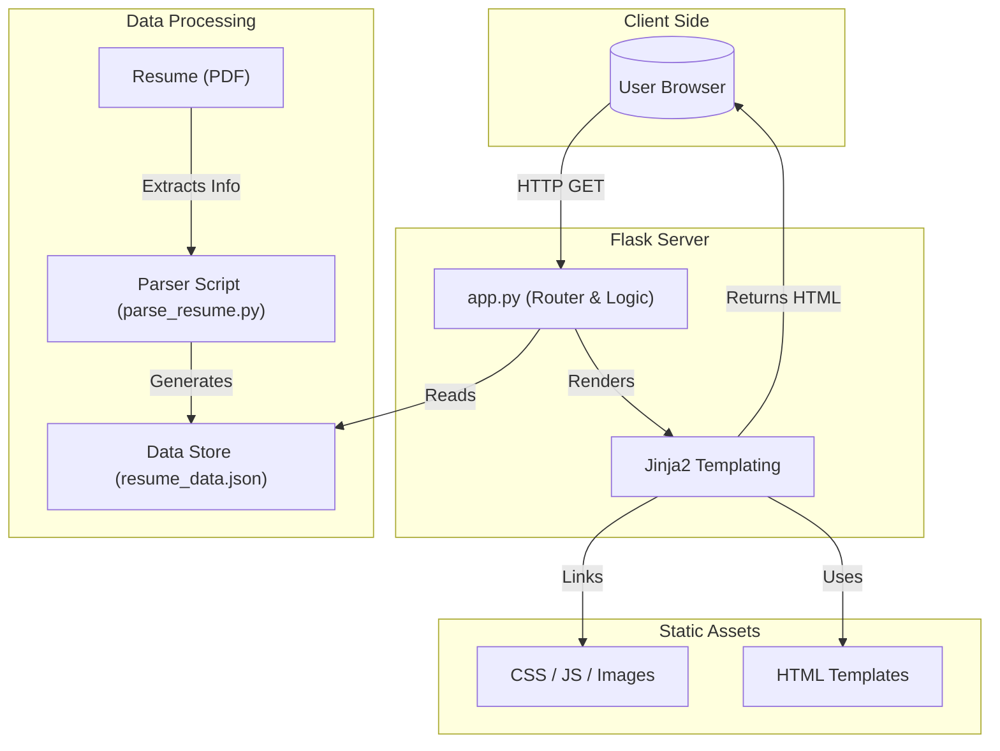

# My Portfolio

A personal portfolio website built with Python and Flask to showcase my skills, experience, and projects as an AI Engineer and Python Developer.

## Table of Contents

- [Features](#features)
- [Technologies Used](#technologies-used)
- [System Architecture](#system-architecture)
- [Project Structure](#project-structure)
- [Setup and Installation](#setup-and-installation)
- [Configuration](#configuration)
- [Deployment](#deployment)

## Features

- **Home Page**: A welcoming hero section with a dynamic typing effect for job titles.
- **Contact Information**: Easy access to my phone, email, and LinkedIn profile.
- **Educational Background**: A dedicated section to display my academic qualifications.
- **Responsive Design**: The layout is optimized for viewing on various devices, including desktops, tablets, and mobile phones.

## Technologies Used

- **Backend**: Python, Flask
- **Frontend**: HTML5, CSS3, JavaScript
- **Templating**: Jinja2
- **Styling**: Bootstrap 5

## System Architecture

The following diagram illustrates the architecture of the Portfolio application, highlighting the data processing pipeline and the interaction between the client, the Flask backend, and frontend resources.



## Project Structure

```
My_Portfolio/
├── app.py              # Main Flask application file
├── config.py           # Configuration settings
├── models.py           # Database models
├── requirements.txt    # Project dependencies
├── data/
│   └── resume_data.json # Parsed data storage
├── scripts/
│   └── parse_resume.py # Resume parsing script
├── static/
│   ├── css/            # Stylesheets
│   ├── js/             # JavaScript files
│   ├── resume/         # Resume PDF storage
│   └── uploads/        # Uploaded images (certs, etc.)
└── templates/
    ├── base.html       # Base template
    ├── index.html      # Home page template
    ├── admin_dashboard.html # Admin interface
    └── ...             # Other HTML templates
```

## Setup and Installation

To run this project locally, follow these steps:

1.  **Prerequisites**:
    - Python 3.7+
    - pip

2.  **Clone the repository**:
    ```bash
    git clone https://github.com/<your-github-username>/My_Portfolio.git
    cd My_Portfolio
    ```

3.  **Create and activate a virtual environment** (recommended):
    ```bash
    # For macOS/Linux
    python3 -m venv venv
    source venv/bin/activate

    # For Windows
    python -m venv venv
    .\venv\Scripts\activate
    ```

4.  **Install dependencies**:
    ```bash
    pip install -r requirements.txt
    ```

5.  **Run the application**:
    ```bash
    flask run
    ```
    The application will be available at `http://127.0.0.1:5000`.


## Configuration

All personal data (contact info, education, projects, etc.) is managed within the `app.py` file. To customize the portfolio with your own information, you will need to modify the data structures in that file.

## Deployment

This Flask application can be deployed to various cloud platforms like Heroku, Vercel, PythonAnywhere, or any VPS. You will need to create a `Procfile` for services like Heroku and configure the web server (e.g., Gunicorn).
